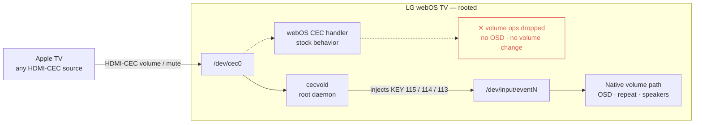

# Volume over CEC

Re-enables Apple TV volume control over HDMI-CEC on LG webOS TV speakers, with the
native on-screen volume bar. A Homebrew Channel app for rooted LG TVs.

## Why

LG webOS ignores inbound CEC volume commands for its own speakers, so an Apple TV
falls back to IR and the iOS Remote app can't change volume at all. This bridges
it back: it catches CEC volume and drives the TV's native volume path, so the
on-screen bar shows and volume works from both the remote and the iOS Remote app.

## Screenshots

| Setup | Status | Settings |
| --- | --- | --- |
|  |  |  |

## Requirements

- A rooted LG webOS TV with the Homebrew Channel. You can check whether your model
  and firmware can be rooted at [cani.rootmy.tv](https://cani.rootmy.tv).

## Install

1. Download the latest `org.webosbrew.cecvold_*.ipk` from the [Releases](../../releases) page.
2. Install it on the TV (via the Homebrew Channel, or Dev Manager Desktop).
3. Open **Volume over CEC** and follow the setup. It checks the TV, finds the
   input your Apple TV is on, and turns the bridge on. It starts automatically on
   every boot.
4. On the Apple TV, set **Settings › Remotes and Devices › Volume Control › HDMI**.

Everything else — detecting the right injection node, installing the boot hook,
testing that CEC volume is coming through, turning it on and off, and jumping to
the Apple TV input — happens inside the app, on its Status, Settings, and
Diagnostics screens.

## How it works

On a rooted TV the app runs a small daemon that watches the HDMI-CEC bus. On
Volume Up, Down, or Mute it injects the matching key event
(`KEY_VOLUMEUP` / `KEY_VOLUMEDOWN` / `KEY_MUTE`) into the input node webOS already
reads, so the TV's own volume path runs — real OSD, native repeat, the same as the
Magic Remote. Because volume now travels over CEC, the iOS Remote app controls it
too. On models where injection isn't honored there's an audio-service fallback
that changes volume without the on-screen bar.



## Building from source

The daemon is a single static C file (`cecvold.c`); the app is a webOS web app
under `app/`. CI builds the ipk and publishes a release on every `vX.Y.Z` tag. To
build locally on Linux (with `gcc-aarch64-linux-gnu` and `@webosose/ares-cli`
installed):

```
aarch64-linux-gnu-gcc -O2 -static -o app/cecvold cecvold.c
ares-package app/
```

See [DISTRIBUTING.md](DISTRIBUTING.md) for cross-architecture builds and Homebrew
Channel store submission.

## Credits

The injection approach follows [magic_mapper](https://github.com/andrewfraley/magic_mapper)'s
handling of LG Magic Remote input on rooted webOS.

## License

MIT — see [LICENSE](LICENSE).
